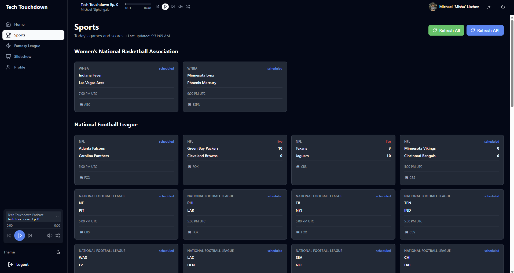
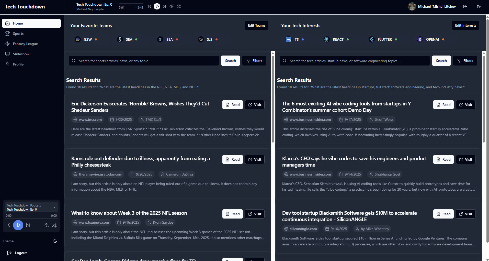
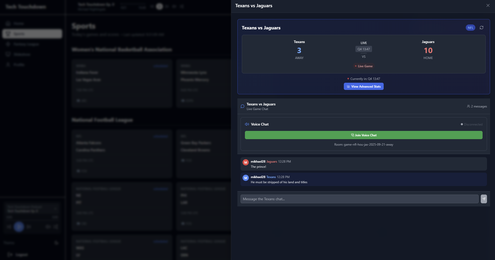

# Tech Touchdown

With questions, contact me at mikhael@hey.com or michael@expatriaonline.com

The repository for the code implemented during the CascadiaJS Hackathon.

## Repository Structure

`react-vite` - Static React website, bundled with Vite & using TypeSript. Styled with Tailwind. Authentication with GitHub.

- Install with `npm install`
- Run dev server with `npm run dev`
- Build bundle with `npm run build`

## Screenshots

  
  
  

`node-service` - Express.js HTTP server, using TypeScript. Includes EXA API & Jina AI integration for sourcing internet data, Neon Serverless Postgres for chatrooms, Twilio for WebRTC audio chat rooms & OpenAI for massaging Markdown into usable JSON.

- Install with `npm install`
- Convert `env.example` into `.env` and populate environment variables.
- `npm run build` to build the JavaScript files for execution within the `dist` folder
- `npm start` runs the built JS files in the `dist` folder.

`react-native` - React Native boilerplate, using Bun, Expo and TypeScript. It was started, but is not currently being used as as 12:30pm on Sunday, for teh purposes of the hackathon. It compiles and shows some proof of concept, but not integrated into the APIs.

- `bun install` to install
- `npx expo start` to run the local dev server
