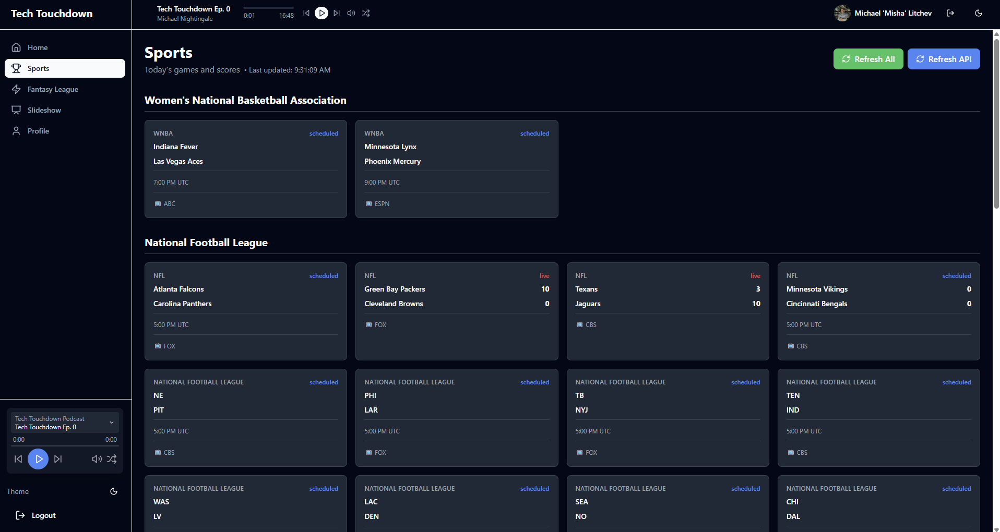

# Tech Touchdown

**Hacker News + Bleacher Report for Software Engineers**

The ultimate platform for software engineers who are sports fans. Get the latest tech news, startup insights, and sports coverage in one place. Built by developers, for developers.

Built with React, TypeScript, and Tailwind CSS.

## Screenshots

<div align="center">
  
  
  
</div>

## Features

- 🏈 Latest sports news and analysis
- 💻 Tech and startup news
- 🌙 Dark mode interface
- 📱 Responsive design
- ⚡ Fast and modern UI

## Getting Started

1. Install dependencies:

```bash
npm install
```

2. Start the development server:

```bash
npm run dev
```

3. Open [http://localhost:3000](http://localhost:3000) in your browser

## Tech Stack

- React 18
- TypeScript
- Vite
- Tailwind CSS
- React Router
- Lucide React Icons
